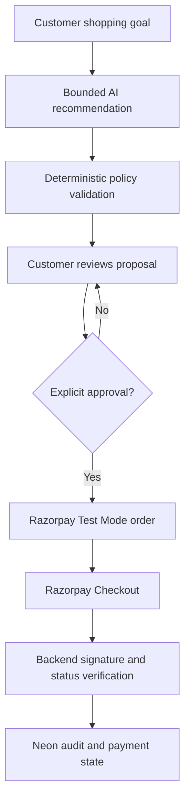

# AgentCart AI

A bounded AI commerce agent built for Razorpay AI Buildathon 2026, Track 1: AI Growth and Agentic Commerce.

> Commerce that asks before it acts.

## Live demo

https://agentcart-ai-razorpay.vercel.app/

AgentCart converts a natural-language shopping goal into a budget-aware proposal, explains its recommendation, waits for explicit approval, creates a real Razorpay Test Mode order and verifies the final payment state.

The AI can recommend and explain. It cannot independently create orders, change trusted prices or claim that a payment succeeded.

## The problem

Commerce assistants are useful for discovery, but allowing an LLM to control payments creates serious risks:

- Hallucinated products or prices
- Purchases without clear customer approval
- Duplicate orders after network failures
- Repeated payment attempts
- False payment-success messages
- Manipulated product IDs, quantities or prices
- Webhook replay and signature attacks
- No useful record explaining what happened

AgentCart demonstrates how an AI shopping experience can increase customer convenience without giving probabilistic software uncontrolled financial authority.

## Core workflow



## What is genuinely AI-powered?

AgentCart uses Groq-hosted `openai/gpt-oss-120b` for:

- Understanding shopping goals
- Producing concise product recommendations
- Explaining why products fit the requested outcome
- Communicating safe recovery options

Every model response is checked against:

- A trusted server-side catalog
- Real product IDs
- Current catalog stock
- The customer's stated budget
- Allowed intents and actions
- Zod response schemas

If the model fails, times out, returns invalid JSON or violates policy, AgentCart switches to a deterministic TypeScript fallback.

## Where AI is deliberately not used

AI does not control:

- Product prices
- Inventory validation
- Order totals
- Customer approval
- Idempotency decisions
- Razorpay order creation
- Payment-signature verification
- Webhook verification
- Final payment status

Financial status answers are read from PostgreSQL instead of being generated by the LLM or trusted from browser state.

## Important safety controls

| Risk | AgentCart control |
| --- | --- |
| Autonomous purchase | Checkout requires `approved: true` |
| Manipulated price | Total is recomputed from the server catalog |
| Unknown product | Product IDs are allow-listed |
| Unsafe quantity | Quantity is restricted and checked against stock |
| Excessive spending | Orders above INR 20,000 are rejected |
| Duplicate approval | Unique proposal/version key prevents another order |
| Lost network response | Existing request is marked unknown and automatic retry is blocked |
| Fake browser success | Backend verifies Razorpay HMAC signature |
| Incorrect payment claim | Backend fetches the payment from Razorpay |
| Fake webhook | Raw-body HMAC verification is required |
| Webhook replay | Event hash is stored with a unique constraint |
| Late failure webhook | An already-paid order cannot be downgraded |
| LLM outage | Deterministic fallback continues safely |
| Prompt injection | Model output cannot bypass deterministic policy code |

## Duplicate-order prevention

Each checkout uses a stable key:

```text
proposalId:proposalVersion
```

Before contacting Razorpay, AgentCart atomically claims this key in PostgreSQL.

If approval is submitted again:

1. The unique database constraint detects the previous request.
2. AgentCart retrieves the existing Razorpay order.
3. The same order ID is returned.
4. No second order is created.

This works for double-clicks, browser retries and lost network responses.

## Failure recovery demonstrations

The interface contains four controlled scenarios.

### 1. Inventory changes mid-chat

An initially recommended item becomes unavailable. AgentCart:

- Blocks the original proposal
- Creates no Razorpay order
- Offers in-stock alternatives
- Requires fresh customer approval

### 2. Order response is lost

The customer retries approval after an uncertain response. AgentCart:

- Detects the existing proposal key
- Reuses the existing Razorpay order
- Prevents duplicate order creation
- Records the decision in the audit trail

### 3. Payment attempt fails

Razorpay Test Mode reports a failed payment. AgentCart:

- Preserves the cart
- Preserves the existing order
- Clearly reports that payment was not completed
- Allows a customer-controlled retry
- Reuses the same order
- Verifies the successful recovery on the backend

### 4. Invalid parameter injection

A request attempts to submit quantity `99` and a client-provided price of `INR 1`. AgentCart:

- Rejects the untrusted price
- Rejects the unsafe quantity
- Creates no Razorpay order
- Explains why the request was blocked

## Verified status questions

Customers can ask:

```text
What is my payment status?
```

The AI does not invent the answer. The backend:

1. Uses the proposal ID to query Neon PostgreSQL.
2. Retrieves the latest checkout order.
3. Retrieves the latest payment attempt.
4. Returns a deterministic customer-friendly explanation.

A forged browser request claiming `"paid"` cannot override the database.

## Technology stack

| Area | Technology |
| --- | --- |
| Framework | Next.js 16.3.4 |
| UI | React 19 and TypeScript |
| Styling | Custom responsive CSS |
| Components | Radix UI and shadcn primitives |
| Icons | Lucide React |
| AI | Groq API with `openai/gpt-oss-120b` |
| AI validation | Zod and deterministic policies |
| Payments | Official Razorpay Node SDK |
| Checkout | Razorpay Standard Checkout.js |
| Database | Neon PostgreSQL |
| ORM and migrations | Drizzle ORM and Drizzle Kit |
| Cryptography | HMAC-SHA256 and timing-safe comparison |
| Tests | Node.js test runner |
| Hosting target | Vercel |
| Source control | Git and GitHub |

## Database model

AgentCart stores four types of records:

- `checkout_orders`: proposal identity, trusted cart, total, receipt and Razorpay order
- `payment_attempts`: Razorpay payment state and failure details
- `webhook_events`: signed event payload, deduplication hash and processing state
- `audit_events`: human-readable evidence of important decisions

The migration is stored in:

```text
drizzle/0000_married_frightful_four.sql
```

## API routes

| Route | Purpose |
| --- | --- |
| `POST /api/agent` | Bounded AI recommendations and verified status explanations |
| `POST /api/checkout` | Approval-gated and idempotent Razorpay order creation |
| `POST /api/payments/verify` | Checkout signature and Razorpay payment verification |
| `POST /api/webhooks/razorpay` | Signed, replay-safe payment event processing |
| `GET /api/health` | Application and database health check |

## Local setup

### Requirements

- Node.js 22.13 or later
- npm
- Neon PostgreSQL connection string
- Groq API key
- Razorpay Test Mode keys

### Installation

```bash
git clone https://github.com/samsudeen-b/agentcart-ai-razorpay.git
cd agentcart-ai-razorpay
npm ci
```

Create `.env.local` from `.env.example`.

```env
GROQ_API_KEY=
DATABASE_URL=
RAZORPAY_KEY_ID=rzp_test_replace_me
RAZORPAY_KEY_SECRET=
RAZORPAY_WEBHOOK_SECRET=
```

Only use Razorpay Test Mode credentials. Never commit `.env.local`.

Apply the committed PostgreSQL migration:

```bash
npm run db:migrate
```

Start the application:

```bash
npm run dev
```

Open:

```text
http://localhost:3000
```

Health check:

```text
http://localhost:3000/api/health
```

Expected response:

```json
{
  "application": "healthy",
  "database": "connected"
}
```

## Razorpay Test Mode demonstration

Successful domestic Visa test card:

```text
4718 6091 0820 4366
```

Insufficient-balance failure test card:

```text
4100 2800 0008 0001
```

Use any future expiry date and a random CVV as permitted by Razorpay Test Mode.

No real money is charged.

## Webhook configuration

After deploying to a public HTTPS domain, configure this endpoint in the Razorpay Test Mode dashboard:

```text
https://your-domain.vercel.app/api/webhooks/razorpay
```

Subscribe to:

- `payment.captured`
- `payment.failed`
- `order.paid`

Use the same private webhook secret in:

- Razorpay Dashboard
- Vercel environment variables
- Local `.env.local`

A local signed-event test helper is included:

```bash
node scripts/test-webhook.mjs
```

## Verification commands

```bash
npm test
npm run lint
npm audit --omit=dev
```

Current verified result:

```text
Tests: 9 passed, 0 failed
Lint: 0 errors
Production dependency audit: 0 known vulnerabilities
Production build: passed
```

## What broke while building

This project documents real engineering failures rather than hiding them.

| Failure | Recovery |
| --- | --- |
| Original Groq model endpoint returned HTTP 404 | Migrated to `openai/gpt-oss-120b` and retained deterministic fallback |
| Repeated approval could create another random order | Added database-first idempotency using proposal ID and version |
| Browser success could not be trusted | Added backend HMAC verification and Razorpay payment fetch |
| A failed payment followed by popup dismissal changed the UI state | Protected terminal failure and verification states from dismissal |
| Webhook retries could repeat processing | Added unique event hashes and processed-state checks |
| Late failure events could downgrade paid orders | Added monotonic paid-state protection |
| Old Vite tests failed after migration to Next.js | Replaced them with Next.js-specific project contract tests |
| Initial dependencies contained production advisories | Updated Next.js and verified zero production vulnerabilities |

## Project structure

```text
app/
  api/
    agent/
    checkout/
    health/
    payments/verify/
    webhooks/razorpay/
  page.tsx
  agentcart.css

components/
  agentcart/

db/
  index.ts
  schema.ts

drizzle/
  0000_married_frightful_four.sql

lib/
  agent-contract.ts
  agent-fallback.ts
  agent-policy.ts
  agentcart-types.ts
  catalog.ts
  demo-state.ts
  razorpay.ts

scripts/
  test-webhook.mjs

tests/
```

## Current limitations

- The product catalog is a controlled demonstration catalog.
- Razorpay is restricted to Test Mode.
- The project does not perform fulfillment or refunds.
- Razorpay cannot send webhooks to localhost; webhook delivery requires a public HTTPS deployment.
- This is a hiring buildathon prototype, not a production merchant account.

## Author

**Samsudeen B**

MCA Generative Artificial Intelligence student

SRM Institute of Science and Technology

- [GitHub](https://github.com/samsudeen-b)
- [LinkedIn](https://www.linkedin.com/in/samsudeen-b-28469a364/)

## References

- [Razorpay Node.js server integration](https://razorpay.com/docs/payments/server-integration/nodejs/integration-steps/)
- [Razorpay Standard Checkout](https://razorpay.com/docs/payments/payment-gateway/web-integration/standard/integration-steps/)
- [Razorpay webhook documentation](https://razorpay.com/docs/webhooks/)
- [Razorpay Test Mode cards](https://razorpay.com/docs/payments/payments/test-card-details/)

## License

MIT