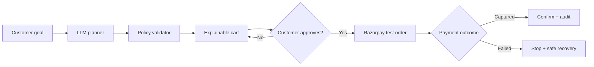

# AgentCart AI

**An explainable, bounded commerce agent built for Razorpay AI Buildathon 2026 — Track 1: AI Growth & Agentic Commerce.**

AgentCart AI turns a natural-language shopping goal into a budget-aware product bundle, explains the recommendation, waits for explicit customer approval, and then creates a Razorpay test-mode order. Every important decision is visible in an audit trail, and a failed payment stops safely instead of triggering an uncontrolled retry.

> Commerce that asks before it acts.

## Why this project exists

Most shopping assistants stop at product recommendations. AgentCart AI closes the loop from intent to checkout while keeping the customer in control.

- **Merchant outcome:** larger, more relevant baskets through explainable cross-sell.
- **Customer outcome:** fewer product comparisons and no hidden payment actions.
- **Safety outcome:** every money action is bounded, gated, validated and auditable.

## Working flow



## What makes it agentic

1. **Observe:** accepts a customer goal, budget and utility constraints.
2. **Plan:** uses Groq Llama 3.3 70B to select products from a trusted catalog.
3. **Verify:** validates model output, inventory IDs, budget and action limits deterministically.
4. **Explain:** shows why each product belongs in the proposed cart.
5. **Gate:** blocks order creation until the customer explicitly approves the amount.
6. **Act:** creates a server-side Razorpay test order using a recomputed trusted price.
7. **Recover:** stops on payment failure and offers a customer-controlled alternative method.
8. **Audit:** records the intent, recommendation, gate, order and payment outcome.

The model proposes. Deterministic code decides whether the proposal is safe to execute.

## Safety and reliability

| Control | Implementation |
| --- | --- |
| Explicit approval | Checkout API accepts only `approved: true` |
| Trusted pricing | Amount is recalculated server-side from a fixed catalog |
| Action ceiling | Orders above ₹20,000 are rejected |
| Output validation | LLM JSON is schema-checked and catalog IDs are allow-listed |
| Budget validation | Recommendations exceeding the stated budget fall back safely |
| Graceful degradation | Deterministic planner works if the LLM is unavailable |
| No uncontrolled retries | Failed payments stop and require a new customer action |
| Webhook authenticity | HMAC-SHA256 signature verification uses the raw request body |
| Secret isolation | API and webhook secrets remain server-side |

## Tech stack

- React 19, TypeScript and Vinext
- Cloudflare Worker-compatible server routes
- Groq API with Llama 3.3 70B Versatile
- Zod for request and model-output validation
- Razorpay Orders API and payment webhooks
- Shadcn UI primitives and Lucide icons
- Node test runner for policy-engine tests

## Local setup

```bash
git clone https://github.com/samsudeen-b/agentcart-ai-razorpay.git
cd agentcart-ai-razorpay
npm install
cp .env.example .env.local
npm run dev
```

Open the local URL printed in the terminal. Without API keys, the complete product and failure-recovery flow runs in safe demo mode.

### Environment variables

```env
GROQ_API_KEY=
RAZORPAY_KEY_ID=rzp_test_...
RAZORPAY_KEY_SECRET=
RAZORPAY_WEBHOOK_SECRET=
```

Use Razorpay **test-mode** credentials only for the buildathon demo. Never commit secrets.

## Razorpay test-mode setup

1. Create a Razorpay test account and generate test API keys.
2. Add the keys to `.env.local`.
3. Configure the webhook URL as `/api/webhooks/razorpay`.
4. Subscribe to `payment.captured` and `payment.failed`.
5. Put the same webhook secret in `RAZORPAY_WEBHOOK_SECRET`.
6. Run a checkout and choose either the success or failure path.

The server creates the order. The included interface simulates the final test-bank outcome so reviewers can exercise both paths without real money. The webhook endpoint is ready for signed Razorpay events.

## Demo scenarios

| Scenario | Expected behavior |
| --- | --- |
| “Desk audio setup under ₹15,000” | Builds a three-item compatible bundle below budget |
| “Travel audio kit under ₹12,000” | Selects ANC headphones and one multi-device charger |
| “Tech gift under ₹6,000” | Selects one portable speaker without forced upsell |
| Order without approval | Rejected by the policy engine |
| Amount above ₹20,000 | Rejected server-side |
| Payment authentication failure | Stops; offers alternative method; logs recovery |
| LLM or network unavailable | Uses deterministic recovery without breaking checkout |

## Run validation

```bash
npm run lint
npm test
```

The automated suite verifies budget extraction, deterministic ranking, mandatory approval, action ceilings and the allowed order path.

## Repository structure

```text
app/
  api/agent/route.ts               constrained LLM planner
  api/checkout/route.ts            gated Razorpay order creation
  api/webhooks/razorpay/route.ts   signed outcome receiver
  page.tsx                         interactive merchant workspace
lib/commerce-engine.mjs            deterministic ranking and policy logic
tests/commerce-engine.test.mjs     guardrail tests
docs/                              architecture and pitch script
```

## Honest limitations

- The catalog and inventory are intentionally small, deterministic demo data.
- The hosted demo defaults to simulated payment outcomes unless Razorpay test keys are configured.
- Production use would add persistent order storage, webhook idempotency records, rate limits, consent-aware notifications and merchant authentication.
- AOV lift shown in the interface is a transparent current-cart projection, not a claimed production experiment result.

## Author

**Samsudeen B** — MCA, Generative Artificial Intelligence  
Python · FastAPI · React · RAG · AI agents · Data applications

Built for the Razorpay AI Builder Internship 2026 selection challenge.

